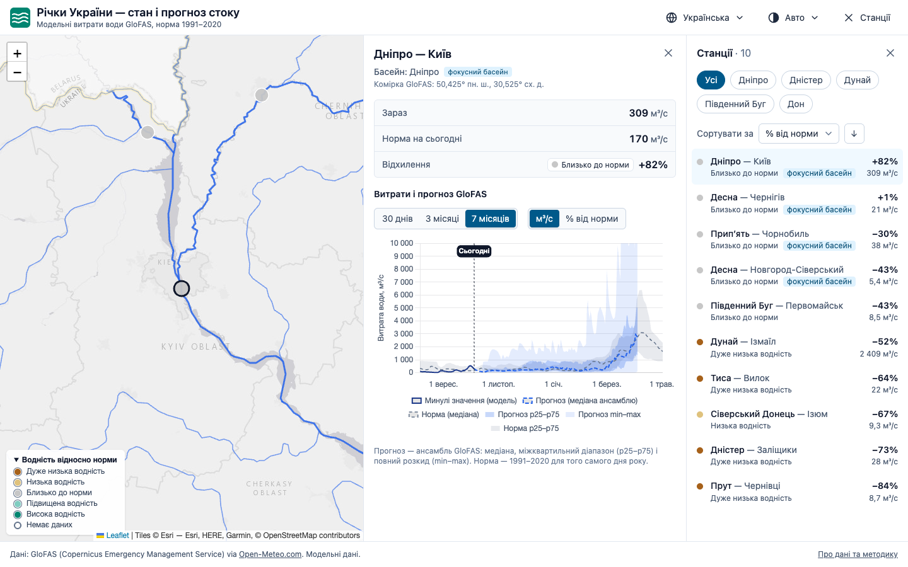

# Річки України — стан і прогноз стоку

[](https://github.com/olede-dev/rivers-ua/actions/workflows/deploy.yml)

Інтерактивна карта водності великих річок України: модельні витрати води GloFAS відносно норми
1991–2020 і ансамблевий прогноз стоку до 7 місяців.

**Демо:** https://olede-dev.github.io/rivers-ua/



## Можливості

- **Карта 10 станцій** на Дніпрі, Десні, Прип'яті, Дністрі, Пруті, Тисі, Дунаї, Південному Бузі та
  Сіверському Донці. Колір маркера — стан водності на сьогодні, розмір — середня річна витрата;
  підказка при наведенні показує витрату і відхилення від норми.
- **Список станцій** з витратою, відхиленням від норми у відсотках і станом водності. Сортування за
  будь-якою колонкою, фільтр за басейном (діє і на карту, і на список).
- **Картка станції**: поточна витрата, норма на сьогодні, відхилення та графік — минулі значення,
  медіана ансамблевого прогнозу зі смугами невизначеності (p25–p75 і min–max), норма і лінія
  «Сьогодні». Горизонт 30 днів / 3 місяці / 7 місяців, одиниці м³/с або % від норми.
- **Посилання на стан**: вибрана станція, басейн, період і режим зберігаються в URL, наприклад
  `#/?station=dnipro-kyiv&range=210&mode=pct`.

## Дані

- **Джерело** — модель [GloFAS v4](https://global-flood.emergency.copernicus.eu/) (Copernicus
  Emergency Management Service) через [Open-Meteo Flood API](https://open-meteo.com/en/docs/flood-api),
  сітка ~5 км. Це **модельні дані, а не спостереження гідрологічних постів**.
- **Норма** — період 1991–2020 за реаналізом GloFAS: для кожного дня року p10, p25, медіана, p75 і
  p90 з усіх значень у вікні ±3 дні. Пораховано один раз скриптом і збережено в
  [`public/data/norms.json`](public/data/norms.json).
- **Стан водності** — витрата Q за сьогодні (за київським часом) відносно норми того самого дня
  року:

  | Стан                 | Умова         |
  | -------------------- | ------------- |
  | Дуже низька водність | Q < p10       |
  | Низька водність      | p10 ≤ Q < p25 |
  | Близько до норми     | p25 ≤ Q ≤ p75 |
  | Підвищена водність   | p75 < Q ≤ p90 |
  | Висока водність      | Q > p90       |

## Запуск

Потрібен Node.js 20.19+ або 22.12+.

```bash
npm ci
npm run dev
```

| Команда                     | Що робить                                             |
| --------------------------- | ----------------------------------------------------- |
| `npm run dev`               | дев-сервер Vite                                       |
| `npm run build`             | перевірка типів і production-збірка в `dist/`         |
| `npm run preview`           | локальний перегляд збірки                             |
| `npm run lint`              | ESLint                                                |
| `npm test`                  | тести Vitest                                          |
| `npm run validate:stations` | перевірка координат станцій через Open-Meteo          |
| `npm run build:norms`       | перерахунок норм 1991–2020 у `public/data/norms.json` |
| `npm run build:geo`         | лінії річок і кордон України (Natural Earth 1:10m, з Кримом) у `public/data/*.geojson` |
| `npm run build:snapshot`    | запасний знімок витрат у `public/data/discharge-snapshot.json` (не комітиться; CI робить його перед кожним деплоєм і щодня) |

Останні дві команди звертаються до Open-Meteo і перезаписують закомічені дані; для звичайної
розробки вони не потрібні. Кожен push у `main` збирається і публікується на GitHub Pages.

## Структура

```
scripts/          генерація даних: валідація станцій, норми
public/data/      norms.json
src/
  api/            запити до Open-Meteo
  lib/            чисті функції: дати, статистика, норми, класи стану, форматування
  composables/    завантаження даних і синхронізація з URL
  components/     карта, список, картка станції, графік
tests/            юніт-тести
```

## Обмеження

- Дані модельні й можуть відрізнятися від офіційних спостережень.
- API повертає найбільшу річку в комірці 5 км, тому координати станцій підібрано скриптом
  валідації. Маркер стоїть на лінії річки, а дані відповідають центру комірки GloFAS.
- Норма рахується за реаналізом, а останні тижні й «сьогодні» — з архівних оперативних прогнозів
  GloFAS, тож порівняння з нормою наближене.